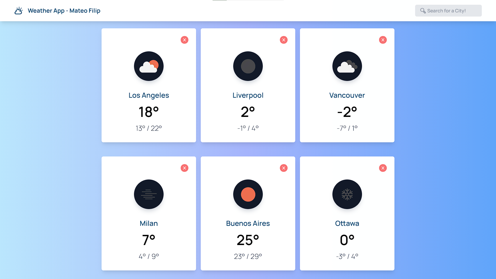

# ⛅ **Videogame App - Mateo Filip**


**Little project made as a evaluative instance at [Soy Henry](https://www.soyhenry.com/)'s web development bootcamp.**

**Search for a city located anywhere in the world and let the app display a card with its current weather information. With varying images and information according to the data brought by Open Weather API, this was one of my first apps, and recently got a little CSS update!**

## 💻 **Used Techonologies**

- **HTML5**
- **CSS3**
- **Tailwind CSS**
- **JavaScript (ES6)**
- **React**
- **Next.js**

## 💻 **Installation**

```
🍂 git clone https://github.com/mateofilip/Weather-App.git
🍂 npm install >> Weather-App/
🍂 npm run dev >> Weather-App/
```

## 💻 **Preview**

<p>

</p>
